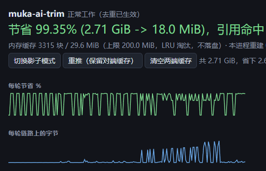

# Muka-AI-Trim

### 为 AI 请求节省 99% 的网络流量

AI agent 的每一轮请求都把整段历史重发一遍：系统提示、工具定义、几十条
message、上一步的截图和工具输出。会话越长，重复越多——一个 125 KB 的请求里可能
有 124 KB 是上游刚刚见过的东西。

Muka-AI-Trim 在笔记本和代理机之间各跑一个进程，两端共同维护一份内容寻址的块缓
存，于是后续每一轮只需要传"这一轮新增的一点点"，**稳态 776 B / 125 KB（节省
99.4%）**。

它不改变上游收到什么：重建出的请求体与 agent 发出的**逐字节相同**，每一轮都由
BLAKE3 摘要在转发前校验，校验不过就整包重发——**宁可慢，也不发错一个 prompt**。



上图是真实使用中的控制台：累计 2.71 GiB 请求体只在线上走了 18.0 MiB（节省
99.35%），缓存 3315 块 / 29.6 MiB（上限 200 MiB，纯内存）。

---

## 效果（实测，不是估算）

一台 Windows 笔记本 + 一台代理机，两个真实进程、真实抓包回放：

| 场景 | 请求体 | 链路实际占用 | 节省 |
| --- | --- | --- | --- |
| OpenAI ChatCompletions 冷启动（含 2 张 base64 截图） | 125,442 B | 63,023 B | 49.8% |
| 同一会话的稳态轮 | 125,531 B | **776 B** | **99.4%** |
| 第二个 agent 复用同一代理端缓存 | 125,531 B | 913 B | 99.3% |
| Anthropic Messages 冷启动 | 25,240 B | 2,211 B | 91.2% |
| Anthropic Messages 稳态轮 | 30,969 B | 1,172 B | 96.2% |
| 回放 4 份真实抓包（累计） | 502,035 B | 63,871 B | 87.3% |

链路开销 1–2 ms/轮。想先在自己流量上量一遍再决定放行，用 `tee` + `replay`（下面
有），它会在不接触真实请求的前提下给出同样口径的数字。

---

## 30 秒上手

两台机器各放一个 `muka-ai-trim` 可执行文件。配置不用手写，各跑一次向导：

```console
# 1) 代理机（有快链路、能直连上游的那台）
muka-ai-trim pair
  这台机器是哪一端？[1] 代理端 [2] 本地端：1
  上游 API 地址 [默认 https://api.openai.com]：
  本机监听地址 [默认 0.0.0.0:18789]：
  真实 API key（可留空）：sk-...
→ 生成配对令牌、写好 muka-ai-trim.config，并把令牌打印给你抄

# 2) 笔记本（跑 agent 的那台）
muka-ai-trim pair
  这台机器是哪一端？：2
  代理端地址：203.0.113.7:18789
  粘贴 pairing_token：...
→ 写好本机的 muka-ai-trim.config

# 3) 启动，两端各一个进程（配置放在 exe 同目录会被自动读取）
muka-ai-trim remote      # 代理机
muka-ai-trim local       # 笔记本

# 4) 把 agent 指过来
set OPENAI_BASE_URL=http://127.0.0.1:18788/v1      # Windows
export ANTHROPIC_BASE_URL=http://127.0.0.1:18788   # Claude SDK / Anthropic 端点
```

然后打开 `http://127.0.0.1:18790/` 看每一轮的 body → wire、引用命中率和曲线。

不想装服务也能长期跑：`muka-ai-trim service install --role local --config
muka-ai-trim.config` 先打印 systemd unit / 计划任务命令，加 `--apply` 才真的执行。

---

## 为什么压缩不够，而"引用"可以

gzip / zstd 只看得到**单个请求内部**的重复，而 agent 流量的重复发生在**请求之
间**：第 40 轮重发的那 120 KB，第 39 轮已经发过了，任何单请求压缩都不知道。

Muka-AI-Trim 因此在两端各存一份内容寻址缓存，把一个请求体拆成
**字面字节段 + 块引用**的"程序"：

```
请求体 = Lit("...") Ref(9a3f…) Ref(1c02…) Lit("...") Ref(77be…) ...
```

* 每个块用自己的 BLAKE3 摘要命名。上游见过的内容第二次出现时，线上只有 20 字节
  的引用，不再是它本身。
* 块可以是**嵌套程序**：一条包含截图的 message 引用那张图，换一轮文字变了，
  1.3 MB 的截图仍然只是一个引用。
* 引用是**稀疏**的，不要求历史是同一个前缀。agent 会往系统提示里塞时间戳、会重排
  `tool_calls.arguments` 的键序、会压缩历史——这些都不影响剩下的块命中。
* 两端用 bloom 过滤器 + 乐观缓存互相告知"我大概有什么"，猜错只多花一次补传
  （`Need` 帧），不会导致错误。
* 上传方向再叠一层 zstd（只压程序/块/整包这类请求方向帧，绝不缓冲返回的 token
  流），稳态那 776 B 里也还能再压。

拆分的层次：消息级稀疏引用 → 消息内长字符串的 CDC 切块 → base64 媒体抽取 →
`tools` 这类整体值 → 不是 JSON 时的 CDC 兜底 → 都不划算就整包直传。另外有一道
**膨胀保护**：任何情况下拆分后的线上体积都不会大于直接发。

### 为什么不会把 prompt 弄错

1. 全程不解析再序列化 JSON。我们只记录字节区间（span），所以不会重排键、不会把
   `1` 变成 `1.0`、不会把 `\uXXXX` 解成字符——那些都会悄悄改变上游 tokenizer 的
   输入，进而打穿它的 prefix cache。
2. 重建 = 把字面段和块按程序拼接，天然逐字节一致。
3. 转发前必须满足 agent 事先声明的 `body_digest` 和长度，不满足就不发，改走整包
   重发并计数（`muka_rebuild_failures_total`）。**协议或缓存出 bug 的代价是多花
   流量，不是发错一个 prompt。**
4. 这条被测试压着：87 个测试（含 12 个走真实 HTTP 的端到端），以及随机 JSON 的
   身份一致性模糊测试；`replay` 还会拿你自己的抓包验证，任何一条无法逐字节重建
   都会让它非零退出。

---

## 支持的接口

| 端点 | 说明 |
| --- | --- |
| `/v1/chat/completions`、`/v1/completions` | OpenAI 及一切兼容网关 |
| `/v1/responses` | 嵌套 `input`、`function_call_output`，按结构识别，不认字段名 |
| `/v1/embeddings`、`/v1/models` | 前者去重，后者直接透传 |
| `/v1/messages`、`/v1/messages/count_tokens` | Anthropic Messages：`system` 块数组、`source.data` 里的 base64 图、`tool_use`/`tool_result`、`input_schema` |

代理端按接口家族选择鉴权头：Anthropic 用 `x-api-key`（并移除 agent 发来的
`Authorization`，缺 `anthropic-version` 时补 `2023-06-01`），OpenAI 家族用
`Authorization: Bearer`。`anthropic-beta` 之类的头与 URL 查询串原样透传——它会影响
上游如何服务这个请求，代理无权改变。未识别的路径不会被去重，只做转发。

---

## 安全与隐私

* **真实 key 只存在于代理机**。agent 可以随便填占位值；也可以在配置里用
  `api_key_file` 指向一个文件，让它不进命令行。
* **配对令牌**：两端必须一致，否则在握手阶段就被拒（`HelloAck ok=false`），一个
  请求都不会转发。令牌少于 16 字符直接拒绝启动。
* **TLS 自管**：`muka-ai-trim remote --tls --tls-dir D` 生成私有 CA 与叶子证书，
  把打印出来的 `ca.der` 拷到笔记本 `--tls --ca ca.der`。两端各自只信任那一个 CA，
  不需要往系统里装任何东西；持有其它任何证书的中间人都连不上。
* **不落盘**：块缓存只在内存里，上限 200 MiB，LRU + TTL 淘汰。prompt 和截图不会
  留在任何磁盘上。
* 默认仍是明文 TCP，适合先跑在 SSH 隧道里；要走公网请把 `tls` 打开。

---

## 控制台与指标

浏览器 `http://127.0.0.1:18790/`（服务端渲染，关掉 JS 也读得懂，数字每几秒刷新）：

* 汇总：累计节省、每轮节省曲线、链路/上游延迟、引用命中、补传、缓存块数与 200 MiB 上限
* 按接口、按 profile、最近若干轮明细（body / wire / 方式 / 跳过原因 / 引用 / 上传）
* 三个动作：`切换影子模式`（只统计、不改动流量）、`重推（保留对端缓存）`、
  `清空两端缓存`（后者会给对端发一条 Reset，所以"清空"名副其实）

机器可读接口：

```
GET /stats       # JSON，与页面同源
GET /metrics     # Prometheus：muka_requests_total、muka_body_bytes_total、
                 # muka_wire_bytes_total、muka_refs_total、muka_refs_hit_total、
                 # muka_blocks_pushed_total、muka_repairs_total、
                 # muka_rebuild_failures_total、muka_store_rejected_total、
                 # muka_link_errors_total …
GET /healthz     # 存活探针
```

命令行等价物：`muka-ai-trim stats --metrics 127.0.0.1:18790`。

---

## 先量一遍，再放行

```console
# 录制：原样转发到上游，并把每个请求体落盘（这一步不去重，零风险）
muka-ai-trim tee --listen 127.0.0.1:18791 --upstream https://api.openai.com --dir cap

# 用真实的 splitter 回放这些抓包：给出每轮 body/wire/节省，并证明能逐字节重建
muka-ai-trim replay cap
muka-ai-trim replay cap --compress false     # 看关掉 zstd 的口径
```

或者让线上流量先走"影子模式"：照常整包发送，只把"本来能省多少"打在日志和页面上。

---

## 多实例

一个文件夹就是一个实例：exe 和 `muka-ai-trim.config` 放在一起，配置会被自动读取
（先找 exe 同目录，再找当前工作目录，`--config` 可显式指定）。复制整个文件夹、改
掉 `listen` / `metrics_listen` 两个端口，就是第二个独立实例——缓存全在内存，所以
实例之间不共享任何文件，也不会有锁冲突。

一台机器上跑多个 agent、共用一份缓存：在配置里写多条 `[[profiles]]`，各自监听不同
端口、拨向同一个 peer，缓存与计数由一个 `Hub` 统一持有。

---

## 配置参考

```toml
# muka-ai-trim.config —— 也可以全部用命令行参数给
role = "local"
pairing_token = "两端必须一致"
metrics_listen = "127.0.0.1:18790"   # 控制台与 /metrics；不写就没有
turn_log_cap = 200                   # 页面保留多少轮明细

[local]
listen = "127.0.0.1:18788"
peer = "127.0.0.1:18789"
max_conns = 8            # 连接池：并发靠连接，不靠多路复用
min_body_bytes = 4096    # 小于这个的请求不值得拆
compress = true          # 上传方向 zstd（绝不缓冲返回的 token 流）
tls = false
tls_ca_file = "ca.der"
shadow = false           # 只统计、整包发送

[remote]
listen = "0.0.0.0:18789"
upstream = "https://api.openai.com"
api_key = "sk-..."       # 或 api_key_file = "muka-ai-trim.key"
tls = false
tls_dir = "/etc/muka"

[store]                  # 全部是内存上限，没有目录
max_bytes = 209715200    # 200 MiB，超出按 LRU 淘汰
max_blocks = 2000000
ttl_secs = 1209600       # 14 天不用就丢
max_block_bytes = 209715200

[policy]                 # 拆分策略，默认值已按 agent 流量调好
enabled = true
min_body_bytes = 4096
min_block_bytes = 384
min_history_block_bytes = 128
min_payload_bytes = 4096
max_body_bytes = 536870912
max_instrs = 200000
max_depth = 6
cdc_min = 8192
cdc_max = 131072
cdc_bits = 15
cdc_fallback = true

[[profiles]]             # 多个 agent，一个进程，一份缓存
name = "agent-a"
listen = "127.0.0.1:18788"
peer = "127.0.0.1:18789"

[[profiles]]
name = "agent-b"
listen = "127.0.0.1:18795"
peer = "127.0.0.1:18789"
```

`[[profiles]]` 里的每一项与 `[local]` 是同一套字段；不写 `[[profiles]]` 就只跑
`[local]` 这一个监听。

---

## 限制（说清楚）

* **省的是链路字节，不是模型 token。** 上游收到的 prompt 一个 token 都不会少，所以
  它不降低推理成本，也不会让上下文变长。上下文超限（例如上游返回
  `prompt is too long`）需要在 agent 侧收紧，代理无能为力。
* 只对"慢的那一跳"有效：笔记本 ↔ 代理机。代理机到上游要快。
* 重启后缓存为空（内存缓存），第一轮接近原大小，之后回到稳态。
* 小请求（< 4 KiB）不拆——拆了更贵，直接透传。
* 需要 agent 允许改 base URL；不能改的进程没法用它。
* 上游的 4xx/5xx 原样返回，代理不重试业务错误（只在链路本身失败时换连接重试一
  次，且保证响应还没开始外发）。
* SSE / 流式响应逐块转发，代理不缓冲整个响应。

---

## 构建

```console
cargo build --release -p muka-bin     # 产物：target/release/muka-ai-trim
cargo test --workspace                # 87 个测试
cargo run -p muka-bin -- doctor       # 检查配置、拆分自测、对端可达性
```

Rust 1.85+；Windows 走 MSVC 工具链，Linux/macOS 无额外要求。TLS 用 `rustls` +
`ring`，不依赖 OpenSSL。

## 仓库结构

| crate | 职责 |
| --- | --- |
| `muka-split` | 字节区间扫描、块程序、拆分策略、CDC、乐观缓存视图 |
| `muka-store` | 内存内容寻址块缓存（LRU/TTL/bloom，写入即校验摘要） |
| `muka-proto` | 变长整数、帧 I/O、消息与块编解码、zstd |
| `muka-gateway` | 两端协议状态机、连接池、TLS、上游转发、控制台与指标 |
| `muka-bin` | 命令行：`local remote pair service doctor stats tee replay` |

线格式（一条连接上顺序承载多个请求，keep-alive 省掉每轮一次握手）：

```
tag:u8 | stream:uvarint | len:uvarint | payload
local  -> remote   Hello, RequestHead, (Program | RequestBody)*, Block*, EndOfBody, [Reset]
remote -> local    HelloAck, [Need | Fail | Reset], ResponseHead, ResponseBody*, Bloom, ResponseEnd
```

## 常见问题

**上游会察觉有个代理吗？** 不会改变请求语义：方法、路径、查询串、头（除逐跳头和
framing 头）、请求体逐字节一致，鉴权头按端点家族选择。

**为什么要两台机器？** 它的价值就在"笔记本上行很贵/很慢"这个场景：代理机负责把
去重后的请求交给上游。只有一台机器时，链路不是瓶颈，省不了什么。

**为什么不用装根证书？** 因为 agent 的 base URL 可以改——直接指向本地监听即可，
不需要 MITM。

**两个 agent 会互相污染缓存吗？** 不会。块由内容命名，同名即同内容；共享的是"有
没有"，不是"是谁的"。

**猜错了对端有没有某个块怎么办？** `Need` 帧补传，代价是一次往返，计数进
`muka_repairs_total`。摘要闸门保证任何情况下都不会把不完整的请求发出去。

---

## 许可与作者

MIT © 2026 [Attect](https://github.com/Attect)

仓库：<https://github.com/Attect/Muka-AI-Trim>（可执行文件名 `muka-ai-trim`）
